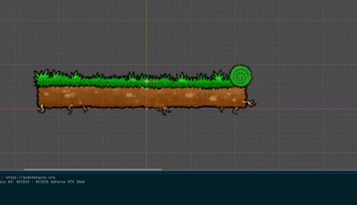
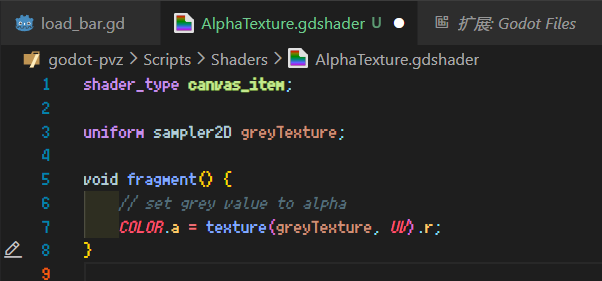
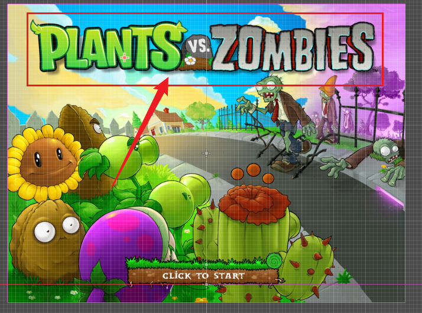
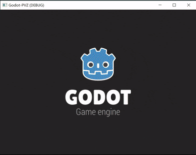
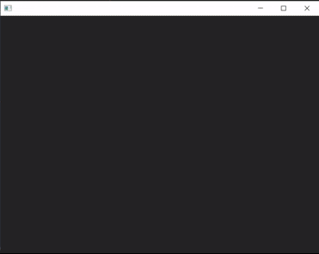
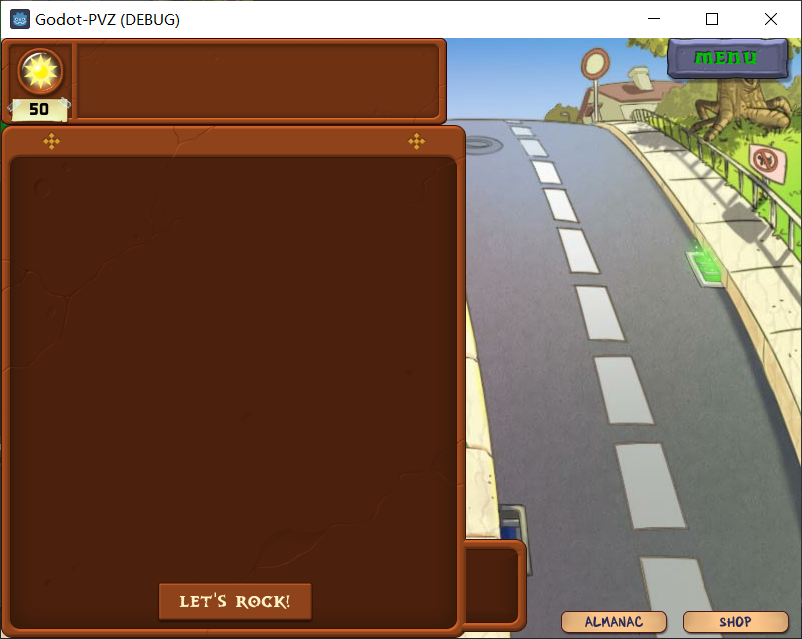
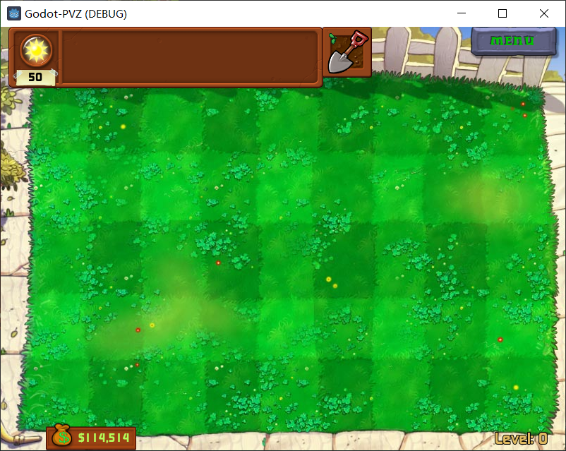
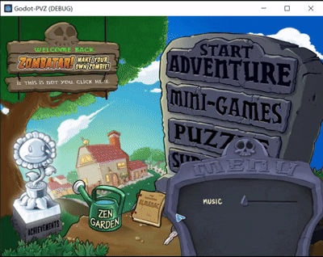
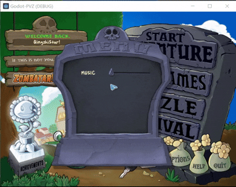

# ☪ Godot PVZ

看到现在这么多pvz二创好想有个自己的pvz呀!

目前在网上没找到什么现成的项目, 就打算自己边学边写啦!

Godot之前用过 , 很舒服 , 给自己加油吧!

## 💟 Milestones

> 这样会让自己更有动力!

🍕 Loading Bar Finished 2025.1.7

💦 第一个Shader! 设置灰度为Alpha! 2025.1.7

❤ Loading Screen Finished! 2025.1.7

🌈 选关界面完成！按钮音效制作 2025.1.7

🍨 种子选择界面完成！- 2025.1.12

🥠 游戏内种子栏 金币 铲子栏 菜单按钮实现！- 2025.1.12

🎇 实现Option Menu拖动，但是没有蒙版，没有边界限制 2025.1.15

🎆 拥有 Mask 的 Option Menu! 自然！ 2025.1.16

